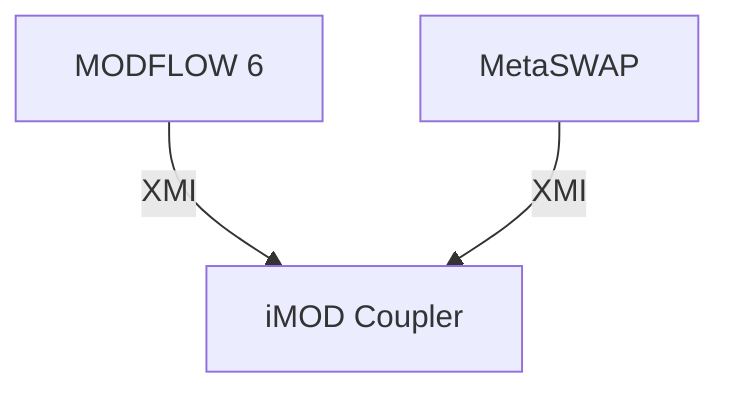

---
# try also 'default' to start simple
theme: seriph
# apply any windi css classes to the current slide
class: 'text-center'
# https://sli.dev/custom/highlighters.html
highlighter: shiki
# show line numbers in code blocks
lineNumbers: false
---

# iMOD Coupler

---

# iMOD Coupler 

- is a shell for coupling hydrological kernels
- provides a framework for:
    - Describing the configuration file
    - Adding different drivers (currently only MODFLOW 6 and MetaSWAP)
    - Adding tests

---

# Coupling

Stolen from Bach's manual

<v-clicks>

1. **Sequential** 
    - First model computes timestep and calculates state
    - Passed on to second model, which computes timestep
2. **Iterative**
    - First model computes timestep and calculates state
    - Passed on to second model, which computes timestep
    - Results in updated boundary condition for first model, which recomputes timestep
    - Second model recomputes its timestep, ... 
    - Iterations are repeated until convergence criteria is met
3. **Fully coupled** 
    - All equations are solved at the same time.

</v-clicks>

---
layout: center
---


---

# From a software point of view


- MODFLOW 6 and MetaSWAP are both compiled as shared libraries
- Both expose a common interface: `XMI`
- iMOD Coupler drives the models through that interface




---

# Data exchange files

All of them can be created by iMOD Python

- MetaSWAP
    - Mapping of MODFLOW cells and MetaSWAP svats (including wells)

- MODFLOW 6
    - Dummy recharge file
    - Dummy well file (in case of sprinkling)

- iMOD Coupler
    - Mapping of MODFLOW cells and MetaSWAP svats (excluding wells)
    - Mapping of MODFLOW recharge cells to MetaSWAP svats
    - Mapping of MODFLOW wells to MetaSWAP svats (only for sprinkling)

---
layout: two-cols
---

# How to use it


- Prepare MODFLOW 6 and MetaSWAP models
- Describe coupling via coupling tables
- Setup `imod_coupler.toml`
- Run iMOD Coupler with <br/> `$ imodc imod_coupler_toml`

::right::

`imod_coupler.toml`
```toml
driver_type = 'metamod'

# modflow 6
[driver.kernels.modflow6]
dll = './kernels/libmf6.dll'
work_dir = './mf6_data'

# metaswap
[driver.kernels.metaswap]
dll = './kernels/MetaSWAP.dll'
dll_dep_dir = './kernels/3rdparty'
work_dir = './msw_data'

[[driver.coupling]]
enable_sprinkling = true
mf6_model = 'inner_model'
mf6_msw_recharge_pkg = 'RCH_MSW'
mf6_msw_well_pkg = 'WELLS_MSW'
mf6_msw_node_map = 'mappings/nodenr2svat.dxc'
mf6_msw_recharge_map = 'mappings/rchindex2svat.dxc'
mf6_msw_sprinkling_map = 'mappings/wellindex2svat.dxc'
```


---

# Things left to do

- Extend documentation
    - 👉 there are plans to add it to a unified iMOD Suite manual

- Add more (realistic) test cases
    - 👉 we still need to figure out test ownership

- Multimodel support for MODFLOW6/MetaSWAP driver

- Add more drivers
    - MODFLOW6/MetaSWAP/D-HYDRO (Lumbricus)
    - MODFLOW6/MetaSWAP/Bach
