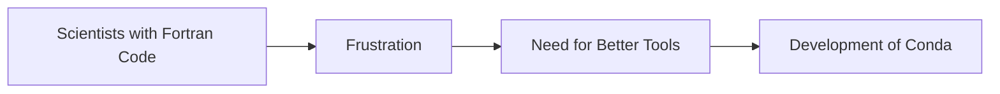

# Pixi, Conda,

and the future of Python development
---

# Who am I?

---
layout: center
---

# Question Time!
---

# How it all started

```mermaid
graph LR
  A[Scientists with Fortran Code] --> B[Frustration]
  B --> C[Need for Better Tools]
  C --> D[Development of Conda]
```

