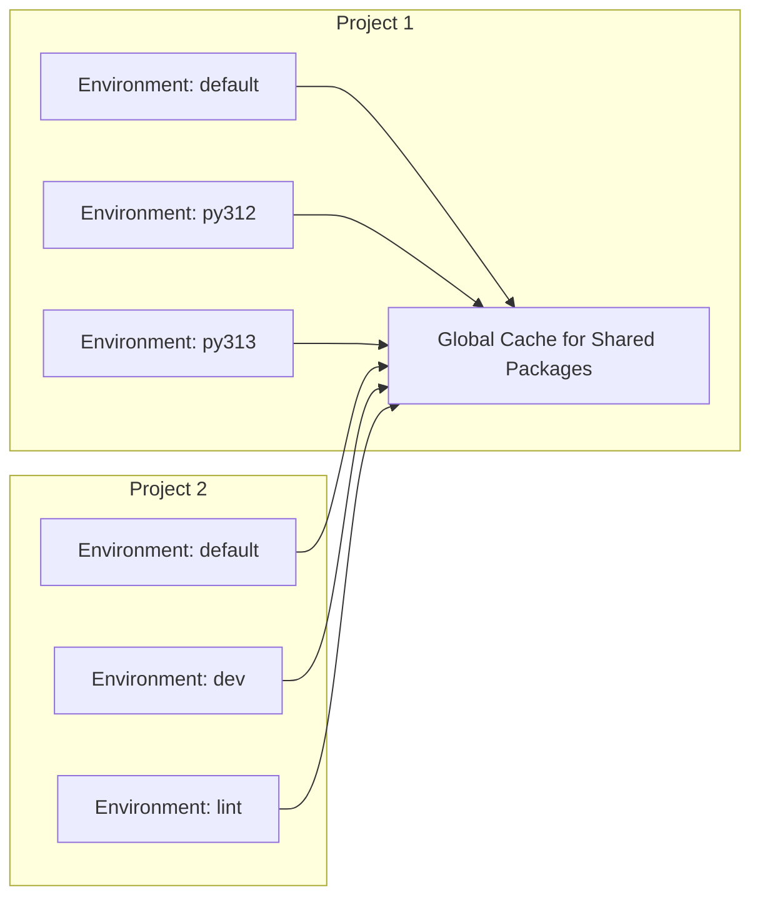

# Pixi, Conda,

and the Future of Python Development
---
layout: image-right
image: julian.jpg
---

# About Me

- Julian Hofer
- ⚛️ Background in Physics
- 💬 Thinks that languages are cool
- 🤓 Loves to talk about package managers

---
layout: center
---

# Question Time!
---
layout: center
---

# Have You Ever Used Python?
---
layout: center
---

# Do You Use Conda to Manage Your Python Environments?
---
layout: center
---

# Do You Use Conda to Develop on Languages *Apart* from Python?
---
layout: image-right
image: numpylogo.svg
backgroundSize: 30em
---

# Installing NumPy via Pip

From the NumPy contributor docs:


- Install NumPy as a user:

```bash
pip install numpy
```

<div v-click>

- Install NumPy as a developer:

```bash
# Debian
sudo apt build-dep numpy
# Fedora
sudo dnf builddep numpy
# Arch
sudo pacman -S gcc-fortran openblas pkgconf
# macOS
brew install openblas pkg-config gfortran
```
Finally
```bash
pip install . --no-build-isolation
```
</div>

---
layout: image-right
image: numpylogo.svg
backgroundSize: 30em
---

# Installing NumPy via Conda

From the NumPy contributor docs:
> If you are using Conda, you can skip the steps in this section - with the exception of installing compilers for Windows or the Apple Developer Tools for macOS. All other dependencies will be installed automatically [...] 


```bash
conda env create -f environment.yml

# or
pixi init --import environment.yml
```


---
layout: center
---

# Ecosystem Comparison

<div class="w-lg">

|                       | Conda | PyPI |
|-----------------------|-------|------|
| Official Python Index | ⚠️    | ✅   |
| Binary Packages       | ✅    | ⚠️   |
| Cross-Platform        | ✅    | ✅   |
| Cross-Language        | ✅    | ⚠️   |
| Decentralized         | ✅    | ⚠️   |
| Traditional Package Manager | conda | pip  |
| Modern Package Manager      | pixi  | uv   |

</div>

---
layout: image-right
image: paxton-text-in-circle.svg
backgroundSize: 40em
---

# Introducing Pixi

- Workflow management
- Multi-environments
- Fast
- Open-Source
- Reproducible thanks to lock-files


---
layout: two-cols
---

# Pixi Workflow

<div class="max-w-xs">

Initialization
```bash
pixi init demo
```
<v-click>

Adding `cowpy` and `python`
```bash
pixi add cowpy python
```

</v-click>

<v-click at="3">


Running a task

```bash
pixi run python hello.py
```

```
 ______________ 
< Hello Munich >
 -------------- 
     \   ^__^
      \  (oo)\_______
         (__)\       )\/\
           ||----w |
           ||     ||
```

</v-click>

</div>

::right::

`pixi.toml`
````md magic-move {at: 1}

<<< @/snippets/pixi-init/pixi.toml

<<< @/snippets/pixi-deps-add/pixi.toml {8-10}

````

<v-click at="2">

`hello.py`

<<< @/snippets/pixi-deps-add/hello.py python


</v-click>

---
layout: two-cols
---

# Tasks

<div class="max-w-xs">

Add a task
```bash
pixi task add hello "python hello.py"
```

<div v-click>


Running a task

```bash
pixi run hello
```

```
 ______________ 
< Hello Munich >
 -------------- 
     \   ^__^
      \  (oo)\_______
         (__)\       )\/\
           ||----w |
           ||     ||
```

</div>

</div>

::right::

`pixi.toml`
<<< @/snippets/pixi-task-add/pixi.toml {6-7}


---
layout: two-cols
---

# Multiple Environments

<div class="max-w-xs">

<v-click>

```bash
pixi run hello --environment=py312
```

```
 _________________________ 
< Hello from Python 3.12! >
 ------------------------- 
     \   ^__^
      \  (oo)\_______
         (__)\       )\/\
           ||----w |
           ||     ||
```

</v-click>
<v-click>

```bash
pixi run hello --environment=py313
```

```
 _________________________ 
< Hello from Python 3.13! >
 ------------------------- 
     \   ^__^
      \  (oo)\_______
         (__)\       )\/\
           ||----w |
           ||     ||
```

</v-click>


</div>

::right::

`pixi.toml`

<<< @/snippets/pixi-multi-env/pixi.toml {9-}{maxHeight: '250px'}


`hello.py`
<<< @/snippets/pixi-multi-env/hello.py

---

# Lock file

- 👐 `pixi.toml`: direct dependencies
- 🔒 `pixi.lock`: whole dependency graph
- 🎆 Fully reproducible setup

<div class="mt-10">

<<< @/snippets/pixi-multi-env/pixi.lock yaml {123-131}{lines: true, maxHeight: '250px'}

</div>


---
layout: two-cols
---

# Space efficient

<div class="max-w-xs">


```bash
tree -L 3 -a
```

```
.
├── .gitattributes
├── .gitignore
├── hello.py
├── .pixi
│   ├── envs
│   │   ├── default
│   │   ├── py312
│   │   └── py313
│   └── .gitignore
├── pixi.lock
└── pixi.toml
```

</div>

::right::

<v-click>



</v-click>

---

<div class="grid grid-cols-6 gap-4 mt-4">
  
  
  
  
  
  
  
  
  
  
  
  
  
  
  
  
  
  
</div>
