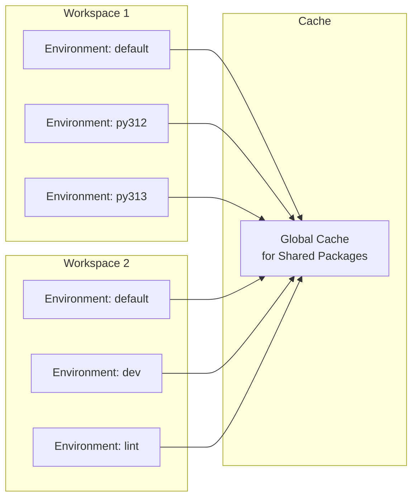
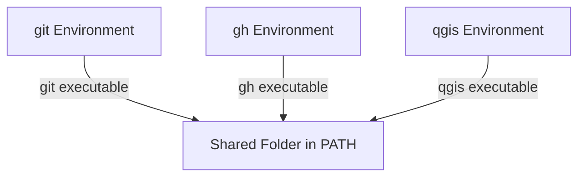
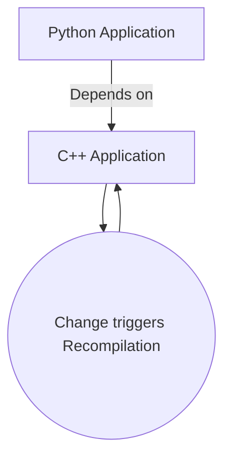

<h1 style="color: var(--slidev-theme-primary)">Unlocking Hidden Power of Conda with Pixi</h1>
By Prefix.dev GmbH

---
layout: image-right
image: team.jpg
---

# About Us 

- 📦 Focused on solving Package Management
- 🚀 Startup, 2.5 years old
- 🌐 Fully remote, spread around Europe
- 🐍 Dedicated to make the conda ecosystem amazing!
- 🦀 Everything in Rust

---
layout: two-cols
---

# What is Conda?

- 📦 Package ecosystem:
  - Cross-platform
  - Cross-language
- 🔬 Commonly used for scientific Python
- 🌐 Decentralized channels like:
  - conda-forge: Most popular channel
  - bioconda: Seperatly managed channel for bioinformatics
  - RoboStack: Automated channel for robotics
- Gifted to the community by Anaconda, Inc.
- Prefix.dev GmbH: revolutionizing the conda ecosystem

::right::

<div class="flex flex-col items-center w-full">
  <div class="relative w-[28rem] h-[22rem] mx-auto">
    
    
    
  </div>
  </div>

---
layout: image-right
image: numpylogo.svg
backgroundSize: 30em
---

# Installing NumPy via Pip

From the NumPy contributor docs:


- Install NumPy as a user:

```bash
pip install numpy
```

<v-click>

- Install NumPy as a developer:

```bash
# Debian
sudo apt build-dep numpy
# Fedora
sudo dnf builddep numpy
# Arch
sudo pacman -S gcc-fortran openblas pkgconf
# macOS
brew install openblas pkg-config gfortran
```
Finally
```bash
pip install . --no-build-isolation
```
</v-click>

---
layout: image-right
image: numpylogo.svg
backgroundSize: 30em
---

# Installing NumPy via Conda

> From the **NumPy** contributor docs:
>
> If you are using conda, you can skip the steps in this section - with the exception of installing compilers for Windows or the Apple Developer Tools for macOS. All other dependencies will be installed automatically [...] 


```bash
conda env create -f environment.yml

# or
pixi init --import environment.yml
```

---
layout: image-right
image: paxton-text-in-circle.svg
backgroundSize: 40em
---

# Introducing Pixi

- ⚡ Fast
- 🆓 Open-Source
- 🛠️ Workflow management
- 🌐 Multi-environments
- 🔒 Reproducible thanks to lock-files
- 🐍 Supports conda and PyPI ecosystem

---
layout: center
---

# Ecosystem Comparison

<div class="w-lg">

| Feature                    | conda | PyPI        |
|----------------------------|-------|-------------|
| Official Python Index      | ⚠️    | ✅          |
| Cross-Platform             | ✅    | ✅          |
| Cross-Language             | ✅    | ⚠️          |
| Decentralized              | ✅    | ⚠️          |
| Traditional Package Manager| conda | pip (conda) |
| Modern Package Manager     | pixi  | uv (pixi)   |


</div>

---
layout: two-cols
---

# What About `uv`?
Or `hatch`, `poetry`, ...

- 💛 Amazing tool, highly appreciate their work.
- Pixi supports PyPI by integrating `uv`.
- Like `pixi`, `uv` uses the workspace model.
- Support both by using `pyproject.toml`.

::right::

`pyproject.toml`
```toml {*}{lines: true}
[project]
name = "my-project"
version = "0.1.0"
dependencies = [
    "matplotlib",
    "numpy",
]

[tool.pixi.workspace]
channels = ["conda-forge"]
platforms = ["linux-64", "osx-arm64", "win-64"]
```

`Terminal`
```bash
pixi run python -c "import matplotlib; import numpy"
# or
uv run python -c "import matplotlib; import numpy"
```

---
layout: two-cols
---

# Pixi Workflow

<div class="max-w-xs">

Initialization
```bash
pixi init demo
```
<v-click>

Adding `cowpy` and `python`
```bash
pixi add cowpy python
```

</v-click>

<v-click at="3">


Running a task

```bash
pixi run python hello.py
```

```
 ______________ 
< Hello All >
 -------------- 
     \   ^__^
      \  (oo)\_______
         (__)\       )\/\
           ||----w |
           ||     ||
```

</v-click>

</div>

::right::

`pixi.toml`
````md magic-move {at: 1}

<<< @/snippets/pixi-init/pixi.toml

<<< @/snippets/pixi-deps-add/pixi.toml {8-10}

````

<v-click at="2">

`hello.py`

<<< @/snippets/pixi-deps-add/hello.py python


</v-click>

---
layout: two-cols
---

# Tasks

<div class="max-w-xs">

Add a task
```bash
pixi task add hello "python hello.py"
```

<div v-click>


Running a task

```bash
pixi run hello
```

```
 ______________ 
< Hello All >
 -------------- 
     \   ^__^
      \  (oo)\_______
         (__)\       )\/\
           ||----w |
           ||     ||
```

</div>

</div>

::right::

`pixi.toml`

<<< @/snippets/pixi-task-add/pixi.toml toml {6-7} {lines: true, maxHeight: '250px'}


---
layout: two-cols
---

# Multiple Environments
<div class="max-w-xs">
<v-click>

```bash
pixi run hello --environment=py312
```

```
 _________________________ 
< Hello from Python 3.12! >
 ------------------------- 
     \   ^__^
      \  (oo)\_______
         (__)\       )\/\
           ||----w |
           ||     ||
```
</v-click>
<v-click>

```bash
pixi run hello --environment=py313
```

```
 _________________________ 
< Hello from Python 3.13! >
 ------------------------- 
     \   ^__^
      \  (oo)\_______
         (__)\       )\/\
           ||----w |
           ||     ||
```

</v-click>

</div>

::right::

`pixi.toml`
<<< @/snippets/pixi-multi-env/pixi.toml toml {12-21}{maxHeight: '10em'}

`hello.py`

<<< @/snippets/pixi-multi-env/hello.py python

---
layout: two-cols
---

# Pixi Build
👷 Under construction

- 🏗️ Build your own conda packages directly from a `pixi.toml` or `pyproject.toml`
- 🐍 Using the build-backend principle like PyPI
- 🛠️ Support multi language monorepos
- 📦 Build and publish to custom channels

::right::

`pixi.toml` (or `pyproject.toml`)

```toml {5-14}{lines: true}
[workspace]
channels = ["conda-forge"]
platforms = ["win-64", "linux-64", "osx-arm64"]

[dependencies]
package-name = { path = "." }

[package]
name = "package-name"
version = "0.1.0"

[package.build]
backend = "pixi-build-python"
```

---

# Lock file

- 👐 `pixi.toml`: direct dependencies
- 🔒 `pixi.lock`: whole dependency graph
- 🎆 Fully reproducible setup

<div v-click class="mt-10">

<<< @/snippets/pixi-multi-env/pixi.lock yaml {123-131}{lines: true, maxHeight: '250px'}

</div>


---
layout: two-cols
---

# Space efficient

<div class="max-w-xs">


```bash
tree -L 3 -a
```

```
.
├── .gitattributes
├── .gitignore
├── hello.py
├── .pixi
│   ├── envs
│   │   ├── default
│   │   ├── py312
│   │   └── py313
│   └── .gitignore
├── pixi.lock
└── pixi.toml
```

</div>

::right::

<v-click>



</v-click>

---

<div class="grid grid-cols-6 gap-4 mt-4">
  
  
  
  
  
  
  
  
  
  
  
  
  
  
  
  
  
  
</div>


---
layout: image-right
image: qgis.jpg
backgroundSize: 28em
---

# Cross-language

- 📝 Version-control with `git` (written in C)

```bash
pixi add git 
```

- 🐙 Manage GitHub repos with `gh` (written in Go)

```bash
pixi add gh
```

- 🌍 Geoscience with `QGIS` (written in C++)

```bash
pixi add qgis
```

---

# Pixi global

- 📦 Replace `apt`, `brew` or `winget` with `pixi`. 
- ➕ `pixi add` adds dependencies to a workspace.
- 🌍 `pixi global install` installs tools globally on your system.
- 🛠️ Each tool is isolated in its own virtual environment.

Usage:
```bash
pixi global install git gh qgis
```

<br/>




---
layout: two-cols
hide: true
---


# Workspace & Source Dependencies

- Experimental, soon to be stabilized
- Build directly from source code
- Manage multiple packages within your workspace
- Useful for:
  - big applications
  - dependencies within one organization

::right::

<div class="flex justify-center">



</div>

---

# Projects using Pixi

<div class="grid grid-cols-3 gap-4 mt-4">
  <div class="bg-black rounded-xl p-4 flex items-center justify-center">
    
  </div>
  <div class="bg-black rounded-xl p-4 flex items-center justify-center">
    
  </div>
  <div class="bg-black rounded-xl p-4 flex items-center justify-center">
    
  </div>
  <div class="bg-black rounded-xl p-4 flex items-center justify-center">
    
  </div>
  <div class="bg-black rounded-xl p-4 flex items-center justify-center">
    
  </div>
  <div class="bg-black rounded-xl p-4 flex items-center justify-center">
    
  </div>
  <div class="bg-black rounded-xl p-4 flex items-center justify-center">
    
  </div>
  <div class="bg-black rounded-xl p-4 flex items-center justify-center">
    
  </div>
  <div class="bg-black rounded-xl p-4 flex items-center justify-center">
    
  </div>
</div>

---
layout: image-right
image: paxton-text-in-circle.svg
backgroundSize: 30em
zoom: 1.2
---

# Conclusion

- Modernize your workflow
  - Reproducible
  - Fast
  - Cross language
- One tool for all your development needs
- Free & Open-Source

---
layout: end
---

# Thank you for your attention!


<div class="text-center mt-15">
  <div class="flex justify-center mt-4">
    <div class="mx-16">
      <a href="https://pixi.sh/latest/" target="_blank">
        
      </a>
      <p class="mt-2"> Pixi Website</p>
    </div>
    <div class="mx-16">
      <a href="https://www.linkedin.com/company/prefix-dev/posts/?feedView=all" target="_blank">
        
      </a>
      <p class="mt-2"><mdi-linkedin /> LinkedIn</p>
    </div>
    <div class="mx-16">
      <a href="https://discord.gg/mJfRpHJ9" target="_blank">
        
      </a>
      <p class="mt-2"><mdi-discord /> Discord</p>
    </div>
  </div>
</div>
